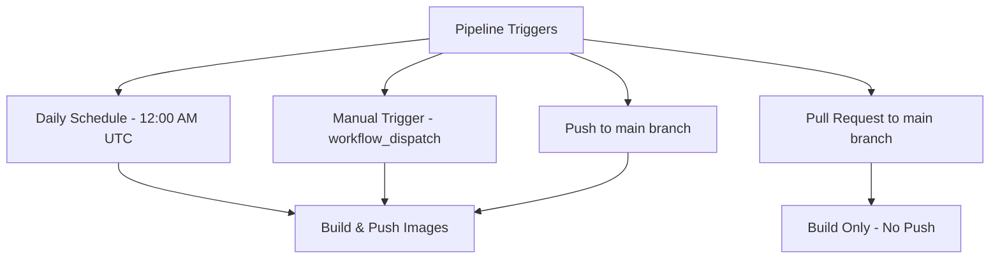
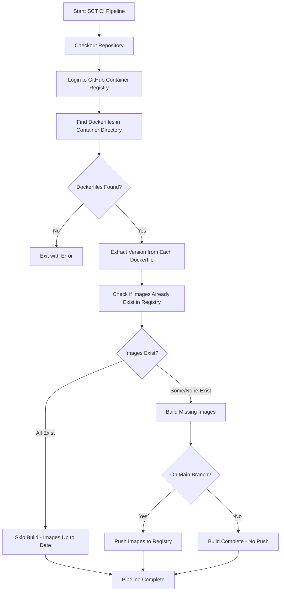
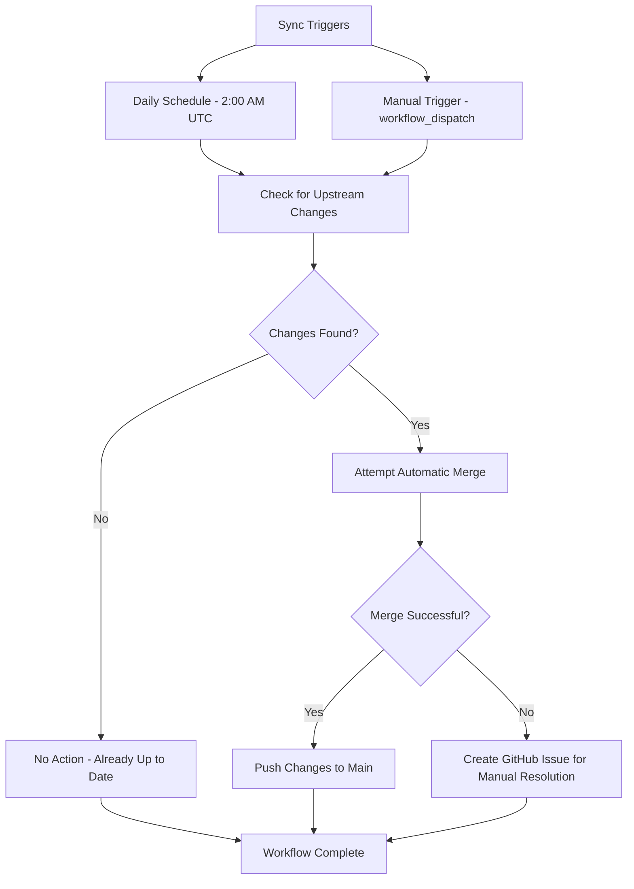
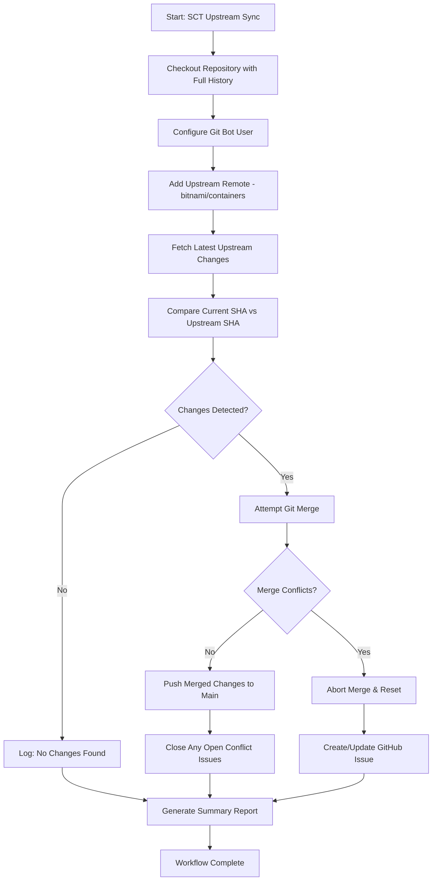
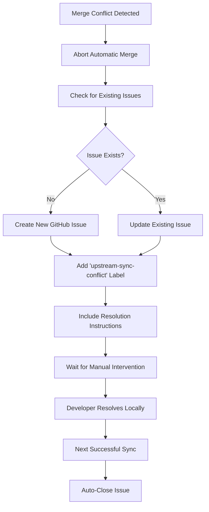
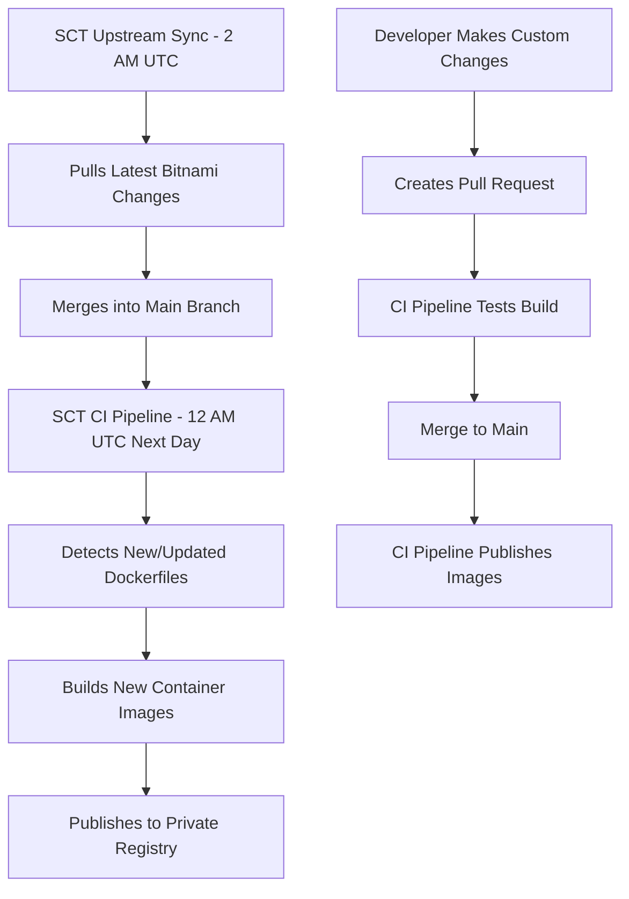

# SCT GitHub Actions Documentation

## Overview

This repository contains two main GitHub Actions workflows that work together to maintain our custom Bitnami container images:

1. **SCT CI Pipeline** - Builds and publishes Docker container images
2. **SCT Upstream Sync** - Keeps our repository synchronized with the upstream Bitnami containers repository

These workflows ensure we always have up-to-date container images while maintaining control over what gets published to our private registry.

## SCT CI Pipeline

The SCT CI Pipeline is a GitHub Actions workflow designed to automatically build and publish Docker container images for selected Bitnami containers. This pipeline helps maintain up-to-date container images in your private GitHub Container Registry without having to manually build and push each image.

### What Does This Pipeline Do?

The CI pipeline automatically:

1. **Discovers** Dockerfiles for specific containers we care about
2. **Checks** if images already exist in the registry to avoid unnecessary rebuilds
3. **Builds** Docker images only when needed
4. **Publishes** images to GitHub Container Registry (but only from the main branch)

### Pipeline Triggers

The CI workflow runs in the following scenarios:



### Container Matrix Strategy

The CI pipeline builds the following containers in parallel (max 3 at a time):

- `os-shell`
- `postgresql`
- `postgres-exporter`
- `redis-cluster`
- `redis-exporter`
- `minio`
- `minio-client`
- `minio-object-browser`

### Detailed Workflow Process



### Step-by-Step Breakdown

#### 1. Repository Setup

- **Checkout**: Downloads the repository code
- **Login**: Authenticates with GitHub Container Registry using the built-in `GITHUB_TOKEN`

#### 2. Dockerfile Discovery

```bash
# Example: For 'postgresql' container
cd "bitnami/postgresql"
find . -name "Dockerfile" -type f
# Finds all Dockerfiles recursively in the directory
```

#### 3. Version Extraction

The pipeline extracts version information from each Dockerfile by looking for:

```dockerfile
LABEL org.opencontainers.image.version="1.2.3"
```

#### 4. Smart Image Checking

Before building, the pipeline checks if an image with the same version already exists:

```bash
# Example check
docker manifest inspect "ghcr.io/your-org/bitnami-postgresql:15.4.0"
```

This prevents unnecessary rebuilds and saves time and resources.

#### 5. Container Building

For images that don't exist, the pipeline:

- Builds the Docker image with a temporary tag
- Tags it with the proper version and registry location
- Cleans up temporary tags

#### 6. Conditional Publishing

- **Main Branch**: Images are pushed to the registry
- **Other Branches/PRs**: Images are built but not pushed (for testing)

### Registry Naming Convention

Images are published with this naming pattern:

```
ghcr.io/[your-organization]/bitnami-[container-name]:[version]
```

Examples:

- `ghcr.io/sct/bitnami-postgresql:15.4.0`
- `ghcr.io/sct/bitnami-redis-cluster:7.2.1`
- `ghcr.io/sct/bitnami-minio:2023.8.31`

### Why This Approach?

#### Efficiency Benefits

1. **Avoids Duplicate Work**: Only builds images that don't already exist
2. **Parallel Processing**: Builds multiple containers simultaneously (max 3)
3. **Scheduled Updates**: Daily checks ensure images stay current
4. **Manual Control**: Can trigger builds on-demand when needed

#### Security Benefits

1. **Branch Protection**: Only main branch can publish to registry
2. **Automated Authentication**: Uses GitHub's built-in token system
3. **Private Registry**: Images are stored in your organization's private registry

#### Development Benefits

1. **PR Testing**: Pull requests build images without publishing them
2. **Easy Debugging**: Manual trigger allows testing specific scenarios
3. **Clear Logging**: Detailed output shows exactly what's happening

### Common Use Cases

#### Daily Maintenance

The scheduled run ensures your container images stay up-to-date with the latest versions from the Bitnami repository.

#### Development Workflow

When working on container modifications:

1. Create a branch and modify Dockerfiles
2. Open a PR - pipeline builds images for testing
3. Merge to main - images are published to registry

#### Emergency Updates

Use the manual trigger (`workflow_dispatch`) when you need to immediately rebuild specific containers outside the normal schedule.

### Monitoring and Troubleshooting

#### Success Indicators

- ✅ All containers in matrix complete successfully
- ✅ Only new/updated images are built
- ✅ Images are properly tagged and pushed (on main branch)

#### Common Issues

- **No Dockerfiles Found**: Check that the container name exists in the `bitnami/` directory
- **Version Extraction Failed**: Ensure Dockerfiles have proper version labels
- **Registry Authentication**: Verify GitHub token permissions include package write access

### Configuration

To add new containers to the build matrix, modify the workflow file:

```yaml
matrix:
  container: ["os-shell", "postgresql", "your-new-container"]
```

The pipeline will automatically discover and build all Dockerfiles in the new container's directory.

## SCT Upstream Sync

The SCT Upstream Sync workflow automatically keeps our repository synchronized with the upstream Bitnami containers repository. This ensures we always have the latest container definitions, security updates, and new features from the official Bitnami repository.

### What Does This Workflow Do?

The sync workflow automatically:

1. **Monitors** the upstream Bitnami containers repository for changes
2. **Merges** new changes from upstream into our main branch  
3. **Handles** merge conflicts intelligently by creating issues for manual resolution
4. **Maintains** synchronization without overwriting our custom modifications

### Sync Triggers

The upstream sync workflow runs in the following scenarios:



### Detailed Sync Process



### Sync Step-by-Step Breakdown

#### 1. Repository Preparation

- **Full Checkout**: Downloads complete git history for proper merging
- **Git Configuration**: Sets up automated bot user for commits  
- **Upstream Setup**: Adds the official Bitnami repository as a remote

#### 2. Change Detection

```bash
# Compare commits to detect changes
UPSTREAM_SHA=$(git rev-parse upstream/main)
CURRENT_SHA=$(git rev-parse HEAD)

# Determine if sync is needed
if [ "$UPSTREAM_SHA" != "$CURRENT_SHA" ]; then
  echo "New changes detected - sync required"
fi
```

#### 3. Automatic Merge Attempt

The workflow tries to automatically merge upstream changes:

```bash
git merge upstream/main --no-edit
```

#### 4. Conflict Resolution

- **Success**: Changes are pushed directly to main branch
- **Conflicts**: Workflow creates a GitHub issue with detailed resolution instructions

#### 5. Issue Management

- **New Conflicts**: Creates issues with `upstream-sync-conflict` label
- **Resolved Conflicts**: Automatically closes related issues
- **Duplicate Prevention**: Updates existing issues instead of creating duplicates

### Conflict Resolution Process

When the automatic merge fails due to conflicts:



### Manual Resolution Steps

When conflicts occur, developers follow these steps:

1. **Clone repository locally**

   ```bash
   git clone https://github.com/your-org/bitnami-containers.git
   cd bitnami-containers
   ```

2. **Add upstream remote**

   ```bash
   git remote add upstream https://github.com/bitnami/containers.git
   git fetch upstream
   ```

3. **Attempt merge and resolve conflicts**

   ```bash
   git merge upstream/main
   # Resolve conflicts in your editor
   git add .
   git commit -m "Resolve upstream sync conflicts"
   ```

4. **Push resolved changes**

   ```bash
   git push origin main
   ```

The next sync run will automatically close the conflict issue.

### Benefits of Automated Sync

#### Continuous Integration

1. **Daily Updates**: Ensures we never fall behind upstream changes
2. **Security Patches**: Automatically pulls in security updates from Bitnami
3. **New Features**: Gets access to new container types and improvements

#### Intelligent Handling

1. **Conflict Detection**: Identifies when manual intervention is needed
2. **Issue Tracking**: Creates clear action items for the team
3. **Automatic Cleanup**: Closes resolved issues automatically

#### Sync Development Workflow

1. **Non-Disruptive**: Runs during off-hours (2 AM UTC)
2. **Manual Override**: Can be triggered manually when needed
3. **Clear Communication**: Provides detailed summaries and reports

### Monitoring Sync Status

#### Sync Success Indicators

- ✅ Sync completes without conflicts
- ✅ Changes are automatically merged and pushed
- ✅ Existing conflict issues are closed

#### Attention Required

- ⚠️ GitHub issues created with `upstream-sync-conflict` label
- ⚠️ Workflow failure notifications  
- ⚠️ Multiple failed sync attempts

#### Example Issue Content

When conflicts occur, the workflow creates detailed issues:

```markdown
## Upstream Sync Conflict

The automated upstream sync failed due to merge conflicts.

**Details:**
- Upstream SHA: `abc123...`
- Current SHA: `def456...`
- Workflow run: [#42](link-to-workflow)

**Action Required:**
Manual intervention is needed to resolve conflicts and merge upstream changes.

**Resolution Steps:**
1. Clone repository locally
2. Add upstream remote
3. Merge and resolve conflicts
4. Push changes
```

### Configuration and Customization

#### Scheduling

The sync runs daily at 2 AM UTC. To modify the schedule:

```yaml
schedule:
  - cron: '0 2 * * *'  # 2 AM UTC daily
```

#### Upstream Repository

Currently syncs with `bitnami/containers`. To change the upstream:

```bash
git remote add upstream https://github.com/different-org/containers.git
```

## How Both Workflows Work Together

The two workflows complement each other perfectly:



### Typical Daily Cycle

1. **2:00 AM UTC**: Upstream sync pulls latest Bitnami changes
2. **12:00 AM UTC (next day)**: CI pipeline builds any new/updated containers
3. **Throughout the day**: Developers can manually trigger either workflow as needed

This ensures your private registry always contains the latest, tested container images with your custom modifications intact.